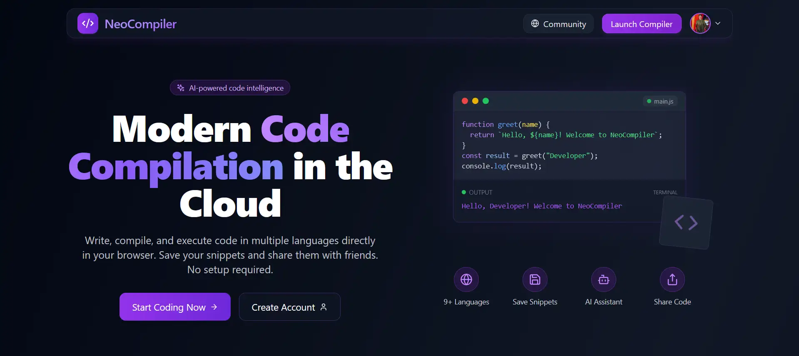

# Neo Compiler

Neo Compiler is a modern and feature-rich online code compiler that supports multiple programming languages. It allows users to write, execute, and share code snippets directly in the browser. The application is built using React and TypeScript, and it leverages the power of the Monaco Editor for a seamless coding experience. Neo Compiler also integrates AI assistance using the Gemini API to help users with code generation, completion, and explanations.



## Features

- **Multi-language Support**: Code in multiple programming languages including JavaScript, TypeScript, Python, Java, C++, C, Go, Rust, and Ruby.
- **Real-time Code Execution**: Execute code directly in the browser with results displayed in real-time.
- **AI Assistance**: Get AI-powered coding help using Gemini API to:
  - Generate code suggestions
  - Complete your code
  - Explain code functionality
- **Code Sharing**: Save and share code snippets with unique shareable links.
- **User Authentication**: Sign up, log in, and manage your saved code snippets.
- **Custom Themes**: Choose from multiple editor themes including Dark and Light mode variants.
- **Custom Inputs**: Supply custom inputs for your code execution.
- **Responsive Design**: Works seamlessly across desktop and mobile devices.
- **Community Feed**: Browse and interact with code snippets shared by other users.

## Tech Stack

- **Frontend**: React, TypeScript, Tailwind CSS
- **Editor**: Monaco Editor (VS Code's editor)
- **Code Execution**: Piston API
- **AI Integration**: Google Gemini API
- **Authentication & Database**: Firebase
- **Routing**: React Router
- **Build Tool**: Vite

## Getting Started

### Installation

1. Clone the repository:
   ```bash
   git clone https://github.com/yourusername/neo-compiler.git
   cd neo-compiler
   ```

2. Install dependencies:
   ```bash
   npm install
   # or
   yarn
   ```

3. Create a `.env` file in the root directory with the following variables:
   ```
   VITE_FIREBASE_API_KEY=your_firebase_api_key
   VITE_FIREBASE_AUTH_DOMAIN=your_firebase_auth_domain
   VITE_FIREBASE_PROJECT_ID=your_firebase_project_id
   VITE_FIREBASE_STORAGE_BUCKET=your_firebase_storage_bucket
   VITE_FIREBASE_MESSAGING_SENDER_ID=your_firebase_messaging_sender_id
   VITE_FIREBASE_APP_ID=your_firebase_app_id
   VITE_GEMINI_API_KEY=your_gemini_api_key
   ```

4. Start the development server:
   ```bash
   npm run dev
   # or
   yarn dev
   ```

5. Open your browser and navigate to `http://localhost:5173`

### Building for Production

```bash
npm run build
# or
yarn build
```

## Usage

### Code Execution

1. Select your preferred programming language from the sidebar
2. Write your code in the editor
3. (Optional) Provide custom input in the input panel
4. Click the "Run" button to execute your code
5. View the output in the output panel

### AI Assistance

1. Click the AI floating button in the bottom right corner
2. Choose the type of assistance you need:
   - Ask for help with your code
   - Get code completions
   - Request code explanations
3. Enter your prompt or question
4. Apply the suggested code changes directly to your editor

### Saving and Sharing Code

1. Click the "Save Code" button in the navigation bar
2. Add a title and description for your code snippet
3. Choose visibility options (public/private)
4. Share the generated link with others

## Project Structure

```
src/
  ├── App.tsx               # Main application component
  ├── index.css             # Global styles
  ├── main.tsx              # Entry point
  ├── types.ts              # TypeScript type definitions
  ├── components/           # React components
  │   ├── auth/             # Authentication components
  │   ├── AIAssistant.tsx   # AI assistance component
  │   ├── CodeEditor.tsx    # Monaco editor component
  │   ├── Compiler.tsx      # Main compiler page
  │   └── ...
  ├── constants/            # Configuration constants
  ├── context/              # React context providers
  ├── hooks/                # Custom React hooks
  └── services/             # API and service functions
```

## Contributing

Contributions are welcome! Please feel free to submit a Pull Request.

1. Fork the repository
2. Create your feature branch (`git checkout -b feature/amazing-feature`)
3. Commit your changes (`git commit -m 'Add some amazing feature'`)
4. Push to the branch (`git push origin feature/amazing-feature`)
5. Open a Pull Request

## License

This project is licensed under the MIT License - see the [LICENSE](LICENSE) file for details.

## Acknowledgements

- [Monaco Editor](https://microsoft.github.io/monaco-editor/) for the code editor
- [Piston API](https://piston-api.github.io/) for code execution
- [Firebase](https://firebase.google.com/) for authentication and database
- [Google Gemini API](https://developers.google.com/gemini) for AI assistance
- [React](https://reactjs.org/) for building user interfaces
- [TypeScript](https://www.typescriptlang.org/) for type safety
- [Tailwind CSS](https://tailwindcss.com/) for styling
- [Vite](https://vitejs.dev/) for fast development and build process
